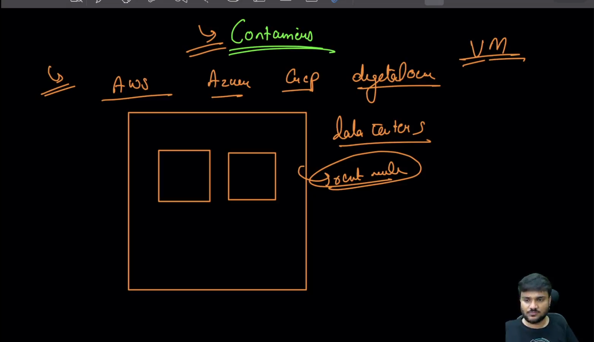
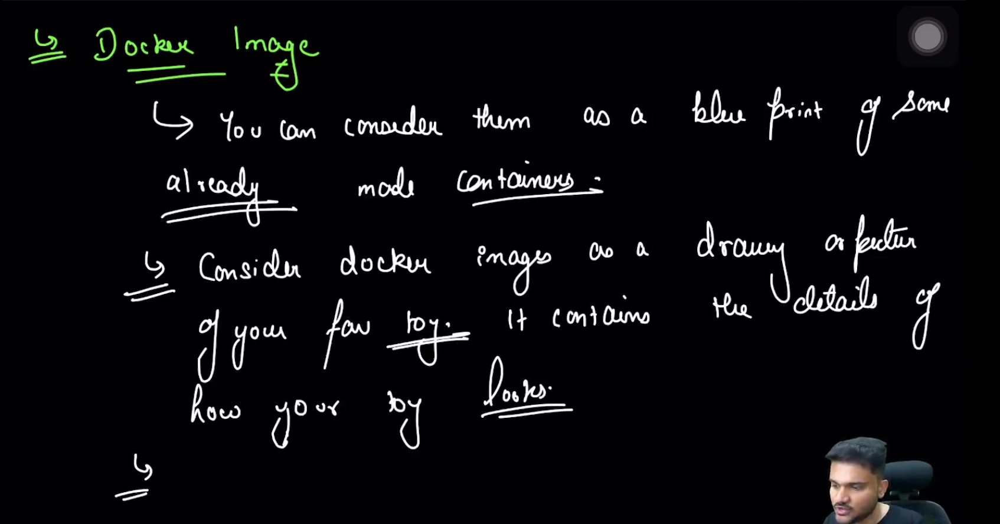
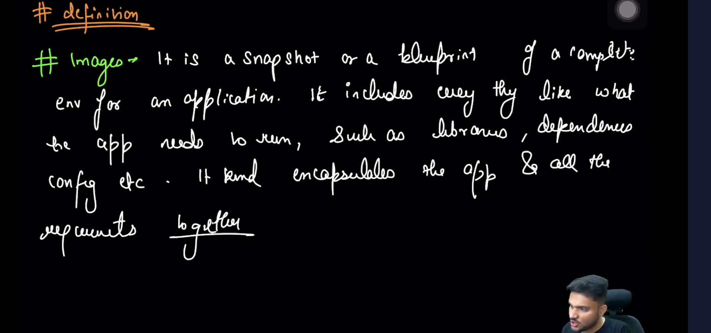
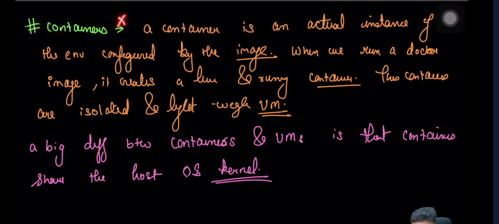
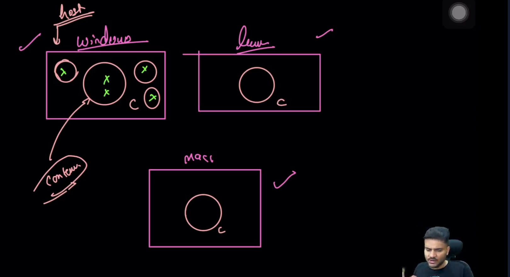

 
 
 - Why Containers
    - Scaling physical M/c if server is deployed ❌
    - Maintenance is difficult ❌
        - Because of above reason public cloud came into picture
            - Rent some machines through data centres (physical m/c)
            - because of one cx, other can also face problem as here VMs are used

 

- how your toy looks,,

 

 

- includes everything, all the requirements together, creates a light & running container, light weight vm

 

- Two interns working on diff laptop, me working on mac, proj dependencies can be sorted using docker
- Docker container ensures os behaves same way in any OS
- Isolated from any dependecy running on host m/c, Multiple docker containers will be isolated though they can be made to communicate after configuring.

 

- commands
  - pulling the docker image from dockerhub `docker pull node`
  - Creates a brand new container from the image,it's like creating an object from class `docker run -it —rm node`
    - `it` - for giving ui
    - `rm` - to exit the container once running is compltd
  - Counting the no of docker images
    - `docker images`
    - `docker images | wc -l`
  - Listing docker container - `docker ps`
  - To remove the images - `docker image prune`
  - run a docker container on the background
    - `docker run --detach -it alpine` or `docker run -dit alpine`
  - To go inside the docker container running on bg
    - `docker attach <hash returned from above command or can check docker id in docker ps>`
    - `docker exec -it <containerId / name>`
    - Diffe b/ run and exec - run takes a brand new container, and in newly created container helps to execute the command, exec run on already created container and runs the command on it.
  - exit a docker container - `docker kill <name of container>`
  - Remove a docker container - `docker rm <name of container>`
  - Giving custom to docker container - `docker run -it --detach --name custom-node node`
  - to inspect about the image - `docker inspect node`
  - to pause the container - `docker pause/unpause  <container-id>`

# Creating custom Image
A Dockerfile is a text file that contains instructions for building a Docker image. Below is a basic example of a Dockerfile that creates a simple Docker image:

```Dockerfile
# Use an existing base image from Docker Hub
FROM alpine:latest

# Set the working directory inside the container
WORKDIR /app

# Copy the application files from the host machine to the container
COPY . /app

# Run a command inside the container (for example, print "Hello, Docker!")
CMD ["echo", "Hello, Docker!"]
```

Let's break down each part of this Dockerfile:

1. **FROM:** Specifies the base image to use for the new image. In this example, we're using the latest Alpine Linux image from Docker Hub. Alpine Linux is a lightweight Linux distribution commonly used for Docker images.

2. **WORKDIR:** Sets the working directory inside the container where subsequent commands will be executed. In this case, it sets the working directory to `/app`.

3. **COPY:** Copies files or directories from the host machine (the directory containing the Dockerfile) into the container. Here, it copies all files from the current directory (.) into the `/app` directory inside the container.

4. **CMD:** Specifies the default command to run when the container starts. In this example, it runs the `echo "Hello, Docker!"` command, which prints "Hello, Docker!" to the console.

To build a Docker image from this Dockerfile, save it as `Dockerfile` in a directory containing your application files, and then run the following command in the terminal:

```
docker build -t my-image .
```
Putting it all together, docker build -t my-image . means "build a Docker image from the Dockerfile in the current directory and tag it with the name my-image.

Once the build is complete, you can run a container from the image using the following command:

```
docker run my-image
```

This will start a container from the `my-image` image and execute the default command specified in the Dockerfile (`echo "Hello, Docker!"`). You should see "Hello, Docker!" printed to the console.