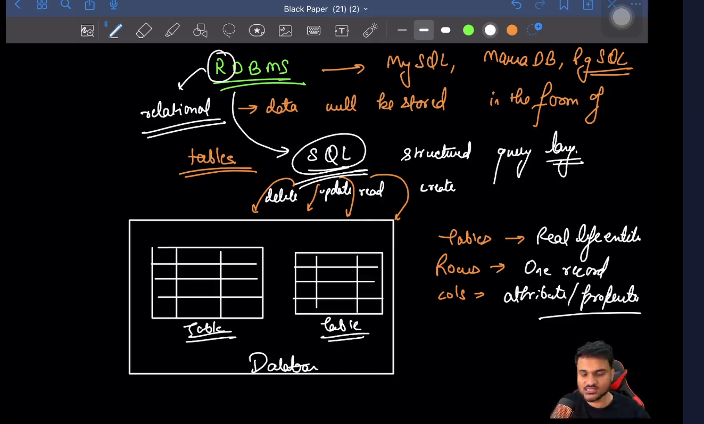
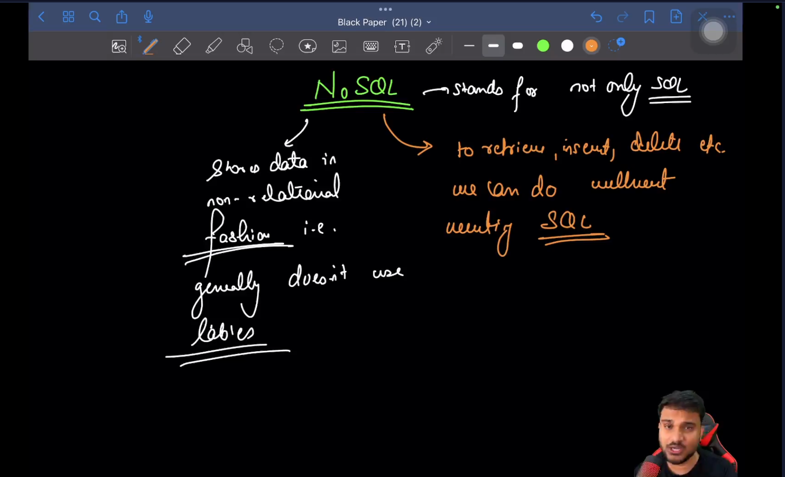
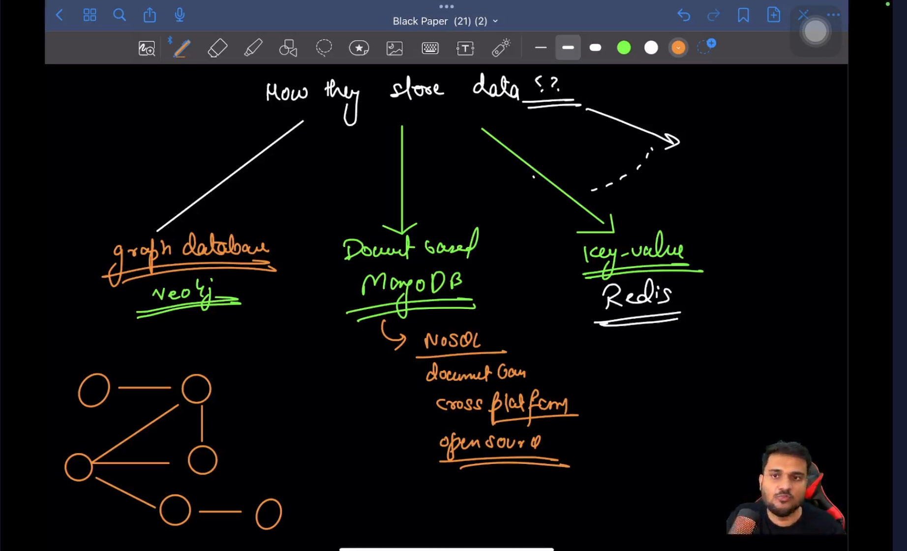
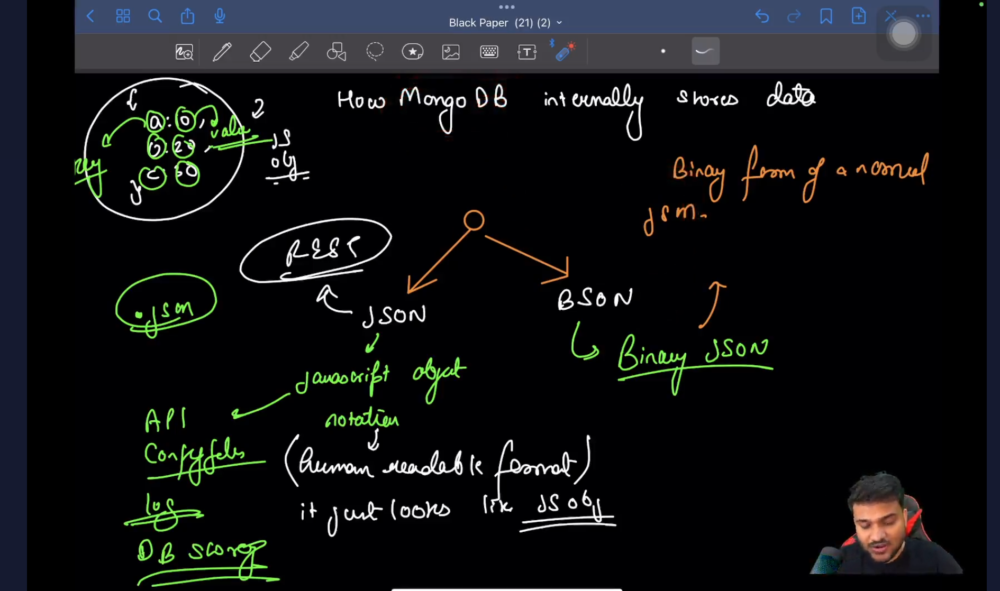
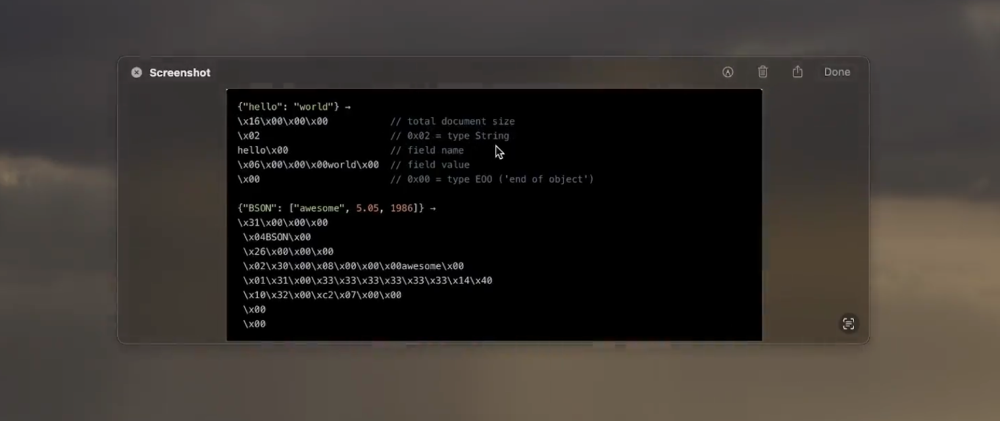

 

 Revision Comparison with RDBMS and NoSQL

 
 

  

  
  

<!-- ##########################################################################################################################################-->

How does mongo stores data internally

  

- communication over the server happens through json
- MongoDB db internally stores data in the form of bson but return response after converitng it in json.
- BSON - updated version of json, stored the length,info, additional details of the data

  

<!-- ##########################################################################################################################################-->

How does mongo stores data internally

